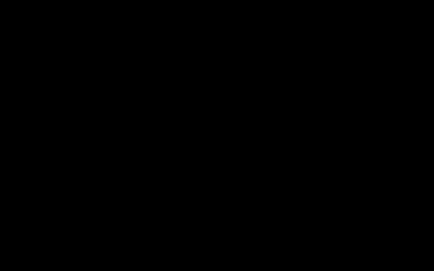

<!-- siso-os:header (generated by sisodias/siso-os-release from repos.json; edit there, not here) -->

  

<h1 align="center">SISO Declassified Records</h1>

<b>A research department for declassified government records, read with a four-truth model.</b>

  
  
  
  

  

  <a href="https://www.sisolabs.space/lens/"><b>Website</b></a> · <a href="https://docs.sisolabs.space">Docs</a> · <a href="https://github.com/siso-os">Every SISO OS project</a>

<!-- /siso-os:header -->

Research department for declassified government records. Split out of the Great
Library of SISO on 2026-08-07 with history preserved.

## The four-truth model

Every record is held at four separable levels:

1. **record truth** — what the document literally contains;
2. **custody and release truth** — how it reached the public;
3. **source-asserted truth** — what the record's author claims;
4. **research conclusion** — what follows after checking competing explanations.

The governing rule: *the system must never silently move from source-asserted
truth to research conclusion.* That is the distinction conspiracy-adjacent
research collapses by default.

## Release is not declassification

"FOIA release and declassification are not synonyms." The taxonomy separates
formal declassification, FOIA, mandatory declassification review, systematic
review, statutory special collections, and archival-open material that was never
classified.

## Rights, safety and ethics

Four safety tiers — standard, enhanced_privacy, hazardous_technical, and
restricted_metadata_only — with principles that constrain what may be built:

- do not assemble a capability manual from individually public records;
- official release does not eliminate risk;
- a name in an intelligence or law-enforcement file is not proof of guilt,
  affiliation, reliability, or agency employment;
- the collection must not become a sensational highlight reel — mundane
  provenance, null findings, and documents showing institutional error are
  preserved deliberately.

The third of those directly constrains any future People Graph link built from
this material.

## Out of scope, explicitly

Leaked or unlawfully obtained material, current intelligence collection or
operational targeting, the remote-viewing module, and the UNSOLVEABLE
mathematics programme.

Verified after the split on 2026-08-07: `verify_module.py` PASS at
module_files=13, sources=37, official_sources=32, collections=30.

## Provenance

Cut from branch `agent/declassified-government-records-department` of
`sisodias/great-library-of-siso`. Registered as a Work in the Great Library with
a `source_repository` locator.